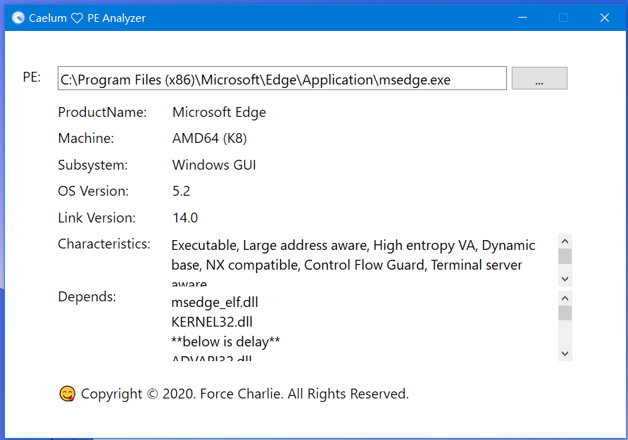

# BelaUtils

[](LICENSE)
[](https://github.com/fcharlie/belautils/actions)
[](https://github.com/fcharlie/belautils/releases/latest)
[](https://github.com/fcharlie/belautils/releases)

Tools reimplemented using Bela library


## Caelum - PE Simple Analysis Tool

Caelum is derived from [PEAnalyzer](https://github.com/fcharlie/PEAnalyzer/), which is a GUI PE analysis tool that can analyze the structure, dependency and other information of PE files.




## Kisasum Hash Utilities

Kisasum is derived from [Kismet](https://github.com/fcharlie/Kismet) and is a hash calculation tool that supports SHA228/SHA256/SHA384/SHA512/SHA3/BAKE3/KangarooTwelve/BLAKE2b/BLAKE2s.

CLI usage:

```shell
kisasum -a BLAKE3 path/to/file
```

GUI Snapshot:


## Krycekium MSI unpacker

Krycekium is derived from  [Krycekium](https://github.com/fcharlie/Krycekium) and is an MSI installation package decompression tool.


## hastyhex

A faster hex dumper fork from [https://github.com/skeeto/hastyhex](https://github.com/skeeto/hastyhex). 


## Wind

Wind - Interesting download tool. Auto use system proxy when download files from network.


Download success:


## Download

Download the latest version of Baulk: [https://github.com/fcharlie/belautils/releases/latest](https://github.com/fcharlie/belautils/releases/latest)

or

```powershell
baulk install belautils
```

